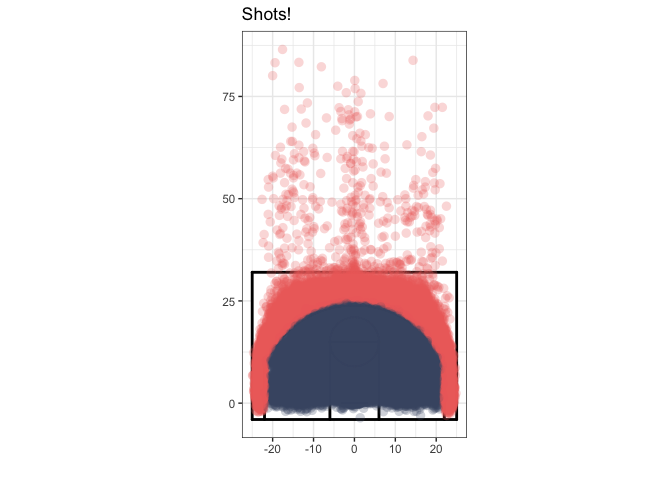
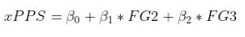
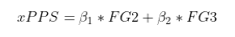
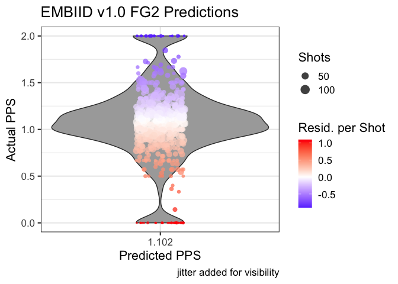

How to Make a Shot Quality Model
================
Andrew Patton

## What is a Shot Quality Model

In general, a shot quality model’s goal is to predict how many points a
player will score based on a shot (PPS). There are three kinds of shots
a player can take, FT, FG2, and FG3. You could make three separate
models or one model that works for all three kinds of shots. One nice
and/or challenging aspect of these models is that you’re more or less
entirely bound between 0-3. If your PPS model is predicting 7, there
might be an issue.

One well documented public example of a good shot quality model is KOBE,
developed by [Krisha Narsu](http://twitter.com/knarsu3) and [published
at Nylon
Calculus](https://fansided.com/2015/09/28/introducing-kobe-a-measure-of-shot-quality/).
The model we develop here will not be as good, but will also not be
named after a Lakers player, so that’s a plus. In fact, we can go ahead
and name ours **EMBIID**, or **E**xtremely **M**ediocre to **B**ad
**I**ntroductory scor**I**ng mo**D**el.

We’re going to be using exclusively shot data derived from play-by-play
data - no tracking or demographic info here. The shots are 100,000
random fieldgoal attempts from the 2018 and 2019 regular seasons.

## Get the Data Set Up

We’re going to read in the data first and just sanity check that it
looks like shot data. Secondly, as this is spatial data, we’re going to
visualize some shots. I cannot emphasize enough how important it is to
be 10000% confident in your coordinate system when you use spatial data.
Spending 8hrs modeling and then realizing you need to change the CRS or
do a bunch of rotations is not a good feeling.

``` r
library(tidyverse)

## Read in the data
shots <- read_csv("data/shots.csv")
set.seed(111)

## Yep, looks like shot data
print(head(shots))
```

    ## # A tibble: 6 x 18
    ##   event_team home_team away_team game_date           event_type quarter_time
    ##   <chr>      <chr>     <chr>     <dttm>              <chr>      <time>      
    ## 1 Detroit P… Detroit … Charlott… 2018-11-11 20:30:00 twopointm… 10:04       
    ## 2 Boston Ce… Boston C… Toronto … 2018-11-17 00:00:00 threepoin… 10:11       
    ## 3 Denver Nu… Denver N… Minnesot… 2020-02-23 23:00:00 twopointm… 06:13       
    ## 4 Phoenix S… Phoenix … Oklahoma… 2018-11-18 02:00:00 threepoin… 09:08       
    ## 5 Los Angel… Clevelan… Los Ange… 2020-02-10 00:30:00 twopointm… 03:09       
    ## 6 Boston Ce… New York… Boston C… 2019-02-02 00:30:00 threepoin… 06:18       
    ## # … with 12 more variables: quarter <dbl>, event_description <chr>,
    ## #   player_name <chr>, shot_style <chr>, shot_made <dbl>, points <dbl>,
    ## #   season <dbl>, seconds_elapsed <dbl>, shot_type <chr>, x <dbl>, y <dbl>,
    ## #   shot_distance <dbl>

``` r
ggplot() +
  geom_rect(data = background_rect_small, 
            aes(xmin = xmin, xmax = xmax, ymin = ymin, ymax = ymax), fill = "white") +
  geom_path(data = circ_df_3, aes(x = x, y = y), color = "black", lwd = 1) +
  geom_path(data = circ_df_key, aes(x = x, y = y), 
            color = "black", lwd = 1) +  
  geom_segment(data = line_df_small, aes(x = x, y = y, xend = xend, yend = yend), 
               color = "black", lwd = 1, lineend = "round") +
  geom_point(data = shots, 
             aes(x = x, y = y, color = shot_type), 
             alpha = 0.25, shape = 16, size = 3) +
  scale_color_manual(values = c("#465775", "#EF6F6C")) +
  guides(color = "none") +
  coord_fixed() +
  labs(x = "",
       y = "",
       title = "Shots!") +
  theme_bw()
```

<!-- -->

Well, that certainly looks correct or close enough. However, there are
quite a few heaves that we probably want to take out of the model since
we probably(?) don’t care about those. Let’s limit it to shots 32 feet
and closer (the top line of the little court). We only lose about 600
shots by doing this, so shouldn’t be an issue.

``` r
print(nrow(shots))
```

    ## [1] 100000

``` r
shots <- shots %>% 
  filter(shot_distance <= 32)

print(nrow(shots))
```

    ## [1] 99391

## Pre-Modeling Interlude

Before we get started, a brief soapbox moment. It can be tempting to
fire up TensorFlow and get crazy here, but starting simple and improving
your model iteratively is a good idea. Go small to big, as you might
find out you don’t need a 40 layer NN to get the job done. (Although
sometimes you do).

## Modeling

The good news about a PPS model is that there is an extremely obvious
first pass model to either test or at least consider. Very slight math
warning approaching.



This is our starting point. This model takes binary flags for FG2 and
FG3 and then returns an expected point per shot value (xPPS). Although,
let’s consider if we actually need an intercept here - what would the
xPPS be if FG2 = 0 and FG3 = 0? It would be zero, so we can actually get
rid of the intercept entirely. You could of course also remove one of
FG2 or FG3 as well and keep the intercept, but I like it this way for
presentation purposes. EMBIID v1.0 is presented below.



Now, let’s use this model setup to train on 75% of the data and test on
25% of the data and see how we do. Fun fact, I learned about
`tidymodels::initial_split()` while writing this\!

``` r
library(tidymodels)

shot_split <- shots %>% 
  mutate(fg2 = ifelse(shot_type == "2PT Field Goal", 1, 0)) %>% 
  mutate(fg3 = ifelse(shot_type == "3PT Field Goal", 1, 0)) %>% 
  initial_split(prop = 0.75)

train_shots <- training(shot_split)
test_shots <- testing(shot_split)

## the '+ 0' indicates to remove the intercept from the model
model <- lm(points ~  fg2 + fg3 + 0, data = train_shots)

summary(model)
```

    ## 
    ## Call:
    ## lm(formula = points ~ fg2 + fg3 + 0, data = train_shots)
    ## 
    ## Residuals:
    ##     Min      1Q  Median      3Q     Max 
    ## -1.1012 -1.1012 -1.0839  0.8988  1.9161 
    ## 
    ## Coefficients:
    ##     Estimate Std. Error t value Pr(>|t|)    
    ## fg2 1.101186   0.005510   199.9   <2e-16 ***
    ## fg3 1.083863   0.007037   154.0   <2e-16 ***
    ## ---
    ## Signif. codes:  0 '***' 0.001 '**' 0.01 '*' 0.05 '.' 0.1 ' ' 1
    ## 
    ## Residual standard error: 1.184 on 74542 degrees of freedom
    ## Multiple R-squared:  0.4607, Adjusted R-squared:  0.4606 
    ## F-statistic: 3.183e+04 on 2 and 74542 DF,  p-value: < 2.2e-16

Good news - our model makes sense. Our FG2 and FG3 coefficients are nice
here because they’re just points per shot\! Now before you go ahead and
start yelling about how the game has changed, keep in mind that there is
**zero** contextualizing information here - just the most basic league
wide efficiency model. Now let’s test.

``` r
predictions <- predict(model, newdata = test_shots)

test_shots <- test_shots %>% 
  mutate(pred_PPS = predictions)

results_by_player <- test_shots %>% 
  group_by(player_name, shot_type) %>% 
  summarise(total_points = sum(points),
            total_pred_points = sum(pred_PPS),
            number_of_shots = n()) %>% 
  ungroup() %>% 
  mutate(total_resid = total_pred_points - total_points) %>% 
  mutate(resid_per_shot = total_resid/number_of_shots) %>% 
  mutate(pps_actual = total_points/number_of_shots) %>% 
  mutate(pps_pred = total_pred_points/number_of_shots)
```

    ## `summarise()` regrouping output by 'player_name' (override with `.groups` argument)

``` r
twos <- results_by_player %>% 
  filter(shot_type == "2PT Field Goal")

threes <- results_by_player %>% 
  filter(shot_type == "3PT Field Goal")

ggplot(data = twos) +
  geom_violin(aes(x = pps_actual, y = pps_pred), fill = "darkgray") +
  geom_jitter(aes(x = pps_actual, y = pps_pred, color = resid_per_shot, size = number_of_shots), 
             shape = 16, alpha = 0.75, height = 0.1) +
  scale_y_continuous(breaks = c(1.102)) +
  scale_color_gradient2(low = "blue",
                        mid = "white",
                        midpoint = 0,
                        high = "red",
                        name = "Resid. per Shot") +
  scale_size(name = "Shots") +
  coord_flip() +
  labs(x = "Actual PPS",
       y = "Predicted PPS",
       title = "EMBIID v1.0 FG2 Predictions",
       caption = "jitter added for visibility") +
  theme_bw(base_size = 16)
```

<!-- -->

``` r
two_error <- mltools::rmse(preds = twos$pps_pred, 
                           actuals = twos$pps_actual, 
                           weights = twos$number_of_shots)

three_error <- mltools::rmse(preds = threes$pps_pred, 
                           actuals = threes$pps_actual, 
                           weights = threes$number_of_shots)

write.csv(twos, "r_test.csv")
```

Well our attempted weighted RMSE for twos is 0.223 and 0.363 for threes.
Not particularly great, but RMSE might also not be the best way to
evaluate this model (not going to be covered here, but this is something
to consider)\! But, that’s to be expected as we’re treating every single
FG2 the same and every FG3 the same. Let’s add some spatial information
in and see if we do better.

``` r
model <- lm(points ~ fg2 + fg3 + shot_distance + 0, data = train_shots)

summary(model)
```

    ## 
    ## Call:
    ## lm(formula = points ~ fg2 + fg3 + shot_distance + 0, data = train_shots)
    ## 
    ## Residuals:
    ##     Min      1Q  Median      3Q     Max 
    ## -1.3678 -1.0812 -0.6585  0.8476  2.1182 
    ## 
    ## Coefficients:
    ##                 Estimate Std. Error t value Pr(>|t|)    
    ## fg2            1.3743111  0.0083377  164.83   <2e-16 ***
    ## fg3            2.0057908  0.0224262   89.44   <2e-16 ***
    ## shot_distance -0.0351676  0.0008133  -43.24   <2e-16 ***
    ## ---
    ## Signif. codes:  0 '***' 0.001 '**' 0.01 '*' 0.05 '.' 0.1 ' ' 1
    ## 
    ## Residual standard error: 1.17 on 74541 degrees of freedom
    ## Multiple R-squared:  0.4738, Adjusted R-squared:  0.4738 
    ## F-statistic: 2.238e+04 on 3 and 74541 DF,  p-value: < 2.2e-16

``` r
predictions <- predict(model, newdata = test_shots)

test_shots <- test_shots %>% 
  mutate(pred_PPS = predictions)

results_by_player <- test_shots %>% 
  group_by(player_name, shot_type) %>% 
  summarise(total_points = sum(points),
            total_pred_points = sum(pred_PPS),
            number_of_shots = n()) %>% 
  ungroup() %>% 
  mutate(total_resid = total_pred_points - total_points) %>% 
  mutate(resid_per_shot = total_resid/number_of_shots) %>% 
  mutate(pps_actual = total_points/number_of_shots) %>% 
  mutate(pps_pred = total_pred_points/number_of_shots)

twos <- results_by_player %>% 
  filter(shot_type == "2PT Field Goal")

threes <- results_by_player %>% 
  filter(shot_type == "3PT Field Goal")

two_error <- mltools::rmse(preds = twos$pps_pred, 
                           actuals = twos$pps_actual, 
                           weights = twos$number_of_shots)

three_error <- mltools::rmse(preds = threes$pps_pred, 
                             actuals = threes$pps_actual, 
                             weights = threes$number_of_shots)
```

This time our RMSE for twos is a slightly smaller 0.203 and 0.364 for
threes. Better on twos now which makes sense given that a average rim
look is far more likely to go in in than an average 19’ jumper, almost
regardless of context.

However, you might be thinking “Aren’t we modeling if a shot goes in or
not, an inherently binary (yes/no) task? Can’t we use a classifier?”.
Yes. Yes we can, and I actually prefer that methodology. Let’s build
EMBIID 3.0 using a logistic classifier. Also, how about another two
improvements with some crude feature crafting. We know that in terms of
twos, rim FGA are the easiest shots and for threes, it’s corner threes
(both by distance and that they tend to me assisted more often). So
let’s make a rim FGA and corner three FGA flag and stick that in there
as well. [Hit this link if you need a quick refresher on how to
interpret the output (IDRE is
awesome)](https://stats.idre.ucla.edu/r/dae/logit-regression/).

``` r
shot_split <- shots %>% 
  mutate(fg2 = ifelse(shot_type == "2PT Field Goal", 1, 0)) %>% 
  mutate(fg3 = ifelse(shot_type == "3PT Field Goal", 1, 0)) %>% 
  mutate(rim_fg = ifelse(shot_distance <= 6, 1, 0)) %>% 
  mutate(corner_three = ifelse(fg3 == 1 & y <= 5, 1, 0)) %>% 
  initial_split(prop = 0.75) 

train_shots <- training(shot_split)
test_shots <- testing(shot_split)

model <- glm(shot_made ~ fg2 + shot_distance + rim_fg + corner_three, 
             data = train_shots, 
             family = "binomial")
summary(model)
```

    ## 
    ## Call:
    ## glm(formula = shot_made ~ fg2 + shot_distance + rim_fg + corner_three, 
    ##     family = "binomial", data = train_shots)
    ## 
    ## Deviance Residuals: 
    ##    Min      1Q  Median      3Q     Max  
    ## -1.505  -1.001  -0.913   1.214   1.516  
    ## 
    ## Coefficients:
    ##               Estimate Std. Error z value Pr(>|z|)    
    ## (Intercept)    0.26276    0.07239   3.630 0.000284 ***
    ## fg2           -0.14419    0.03975  -3.627 0.000286 ***
    ## shot_distance -0.03222    0.00265 -12.156  < 2e-16 ***
    ## rim_fg         0.63161    0.03494  18.078  < 2e-16 ***
    ## corner_three   0.05645    0.03406   1.657 0.097497 .  
    ## ---
    ## Signif. codes:  0 '***' 0.001 '**' 0.01 '*' 0.05 '.' 0.1 ' ' 1
    ## 
    ## (Dispersion parameter for binomial family taken to be 1)
    ## 
    ##     Null deviance: 103211  on 74543  degrees of freedom
    ## Residual deviance:  97756  on 74539  degrees of freedom
    ## AIC: 97766
    ## 
    ## Number of Fisher Scoring iterations: 4

Snazzy. Our two new variables appear to add value to the model (EMBIID
3.0), so let’s take a look at some testing results.

``` r
library(knitr)

## don't forget type = "response" if you want probabilities from this
preds <- predict(model, newdata = test_shots, type = "response")

test_shots <- test_shots %>% 
  mutate(xFG = preds) %>% 
  mutate(xPTS = ifelse(shot_type == "2PT Field Goal", 2 * xFG, 3 * xFG)) %>% 
  ungroup()

fg2 <- test_shots %>% 
  group_by(player_name, shot_type) %>% 
  summarise(PTS = sum(points),
            xPTS = sum(xPTS),
            number_of_shots = n(),
            number_of_makes = sum(shot_made), 
            `xFG%` = mean(xFG)) %>% 
  ungroup() %>% 
  mutate(mean_FG = number_of_makes/number_of_shots) %>% 
  filter(shot_type == "2PT Field Goal") %>% 
  top_n(10, wt = number_of_shots) %>% 
  mutate(`FG%` = round(mean_FG, 3)) %>% 
  mutate(`xFG%`= round(`xFG%`, 3)) %>% 
  mutate(xPTS = round(xPTS, 1)) %>% 
  select(Player = player_name,
         FG2A = number_of_shots,
         FG2M = number_of_makes,
         `FG%`,
         `xFG%`,
         PTS,
         xPTS) %>% 
  mutate(`Shot Making` = round((PTS - xPTS)/FG2A, 2))
         

knitr::kable(fg2, align = "c", caption = "Shot Making for Top Ten by FG2A")
```

|        Player         | FG2A | FG2M |  FG%  | xFG%  | PTS | xPTS  | Shot Making |
| :-------------------: | :--: | :--: | :---: | :---: | :-: | :---: | :---------: |
|     Anthony Davis     | 115  |  59  | 0.513 | 0.532 | 118 | 122.3 |   \-0.04    |
|     Bradley Beal      | 112  |  63  | 0.562 | 0.536 | 126 | 120.2 |    0.05     |
|     DeMar DeRozan     | 140  |  74  | 0.529 | 0.489 | 148 | 136.9 |    0.08     |
|   Donovan Mitchell    | 116  |  52  | 0.448 | 0.522 | 104 | 121.1 |   \-0.15    |
| Giannis Antetokounmpo | 127  |  83  | 0.654 | 0.598 | 166 | 151.9 |    0.11     |
|   LaMarcus Aldridge   | 136  |  81  | 0.596 | 0.502 | 162 | 136.5 |    0.19     |
|     LeBron James      | 117  |  73  | 0.624 | 0.580 | 146 | 135.6 |    0.09     |
|    Nikola Vucevic     | 136  |  79  | 0.581 | 0.520 | 158 | 141.6 |    0.12     |
|   Russell Westbrook   | 130  |  71  | 0.546 | 0.552 | 142 | 143.4 |   \-0.01    |
|      Zach LaVine      | 116  |  52  | 0.448 | 0.562 | 104 | 130.3 |   \-0.23    |

Shot Making for Top Ten by FG2A

So here we have a table that shows the players with the top ten most
FG2A in our test set and their various actual and predicted FG% and
points scored. The last column, ‘Shot Making’ shows on a per shot basis,
the differential between that player taking the shot and more or less
the league average. DDR is positive because he’s quite good at the
midrange compared to the rest of the league, whereas someone like Zach
LaVine is significantly negative on a per shot basis. However, as the
number one ball handling option on their team, sometimes lead guard
types can be forced to take the junk shots or end of clock shots that no
one else can get/create for themselves. Also, they might not be on the
receiving end of many high quality passes. Just things to think about
when using these context free models to make any Big Internet Takes.

Now you have been armed with the tools to explore your own quality
models. Think about how to include player level information, matchups,
lineups, etc. You can get as crazy as you want to with these. See if you
can duplicate some of the information in KOBE (you won’t be able to
because it’s SportVU data) but do your best.
