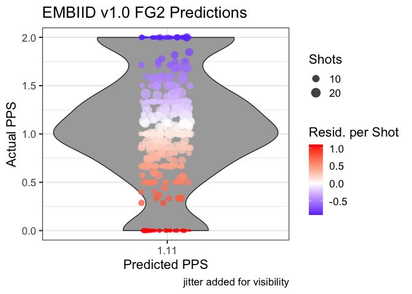

How to Make a Shot Quality Model
================
Andrew Patton

## What is a Shot Quality Model

In general, a shot quality model’s goal is to predict how many points a
player will score based on a shot (PPS). There are three kinds of shots
a player can take, FT, FG2, and FG3. You could make three separate
models or one model that works for all three kinds of shots. One nice
and/or challenging aspect of these models is that you’re more or less
entirely bound between 0-3. If your PPS model is predicting 7, there
might be an issue.

One well documented public example of a good shot quality model is KOBE,
developed by [Krisha Narsu](http://twitter.com/knarsu3) and [published
at Nylon
Calculus](https://fansided.com/2015/09/28/introducing-kobe-a-measure-of-shot-quality/).
The model we develop here will not be as good, but will also not be
named after a Lakers player, so that’s a plus. In fact, we can go ahead
and name ours **EMBIID**, or **E**xtremely **M**ediocre to **B**ad
**I**ntroductory scor**I**ng mo**D**el.

We’re going to be using exclusively shot data derived from play-by-play
data - no tracking or demographic info here. The shots are 20,000 random
fieldgoal attempts from the 2018 and 2019 regular seasons.

## Get the Data Set Up

We’re going to read in the data first and just sanity check that it
looks like shot data. Secondly, as this is spatial data, we’re going to
visualize some shots. I cannot emphasize enough how important it is to
be 10000% confident in your coordinate system when you use spatial data.
Spending 8hrs modeling and then realizing you need to change the CRS or
do a bunch of rotations is not a good feeling.

``` r
library(tidyverse)

## Read in the data
shots <- read_csv("data/shots.csv")
set.seed(42)

## Yep, looks like shot data
print(head(shots))
```

    ## # A tibble: 6 x 18
    ##   event_team home_team away_team game_date           event_type quarter_time
    ##   <chr>      <chr>     <chr>     <dttm>              <chr>      <time>      
    ## 1 Charlotte… Brooklyn… Charlott… 2019-11-21 00:30:00 twopointm… 08:10       
    ## 2 Memphis G… Memphis … Denver N… 2020-01-29 01:00:00 twopointm… 04:23       
    ## 3 Detroit P… Detroit … Milwauke… 2020-02-21 00:00:00 threepoin… 09:51       
    ## 4 New Orlea… Golden S… New Orle… 2019-12-21 03:30:00 twopointm… 03:51       
    ## 5 Boston Ce… Boston C… Orlando … 2019-04-07 23:30:00 twopointm… 02:41       
    ## 6 Houston R… Houston … New Orle… 2019-01-30 01:00:00 threepoin… 10:05       
    ## # … with 12 more variables: quarter <dbl>, event_description <chr>,
    ## #   player_name <chr>, shot_style <chr>, shot_made <dbl>, points <dbl>,
    ## #   season <dbl>, seconds_elapsed <dbl>, shot_type <chr>, x <dbl>, y <dbl>,
    ## #   shot_distance <dbl>

``` r
ggplot() +
  geom_rect(data = background_rect_small, 
            aes(xmin = xmin, xmax = xmax, ymin = ymin, ymax = ymax), fill = "white") +
  geom_path(data = circ_df_3, aes(x = x, y = y), color = "black", lwd = 1) +
  geom_path(data = circ_df_key, aes(x = x, y = y), 
            color = "black", lwd = 1) +  
  geom_segment(data = line_df_small, aes(x = x, y = y, xend = xend, yend = yend), 
               color = "black", lwd = 1, lineend = "round") +
  geom_point(data = shots, 
             aes(x = x, y = y, color = shot_type), 
             alpha = 0.25, shape = 16, size = 3) +
  scale_color_manual(values = c("#465775", "#EF6F6C")) +
  guides(color = "none") +
  coord_fixed() +
  labs(x = "",
       y = "",
       title = "Shots!") +
  theme_bw()
```

<!-- -->

Well, that certainly looks correct or close enough. However, there are
quite a few heaves that we probably want to take out of the model since
we probably(?) don’t care about those. Let’s limit it to shots 32 feet
and closer (the top line of the little court). We only lose about 120
shots by doing this, so shouldn’t be an issue.

``` r
print(nrow(shots))
```

    ## [1] 20000

``` r
shots <- shots %>% 
  filter(shot_distance <= 32)

print(nrow(shots))
```

    ## [1] 19881

## Pre-Modeling Interlude

Before we get started, a brief soapbox moment. It can be tempting to
fire up TensorFlow and get crazy here, but starting simple and improving
your model iteratively is a good idea. Go small to big, as you might
find out you don’t need a 40 layer NN to get the job done. (Although
sometimes you do).

## Modeling

The good news about a PPS model is that there is an extremely obvious
first pass model to either test or at least consider. Very slight math
warning approaching.

\[
xPPS = {\beta_0} + {\beta_1}*FG2 + {\beta_2} * FG3   
\] This is our starting point. This model takes binary flags for FG2 and
FG3 and then returns an expected point per shot value (xPPS). Although,
let’s consider if we actually need an intercept here - what would the
xPPS be if FG2 = 0 and FG3 = 0? It would be zero, so we can actually get
rid of the intercept entirely. EMBIID v1.0 is presented below.

\[
xPPS = {\beta_1}*FG2 + {\beta_2} * FG3   
\]

Now, let’s use this model setup to train on 15,000 random shots and
train on 5,000 random shots and see how we do. Fun fact, I learned about
`tidymodels::initial_split()` while writing this\!

``` r
library(tidymodels)

shot_split <- shots %>% 
  mutate(fg2 = ifelse(shot_type == "2PT Field Goal", 1, 0)) %>% 
  mutate(fg3 = ifelse(shot_type == "3PT Field Goal", 1, 0)) %>% 
  initial_split(prop = 0.75)

train_shots <- training(shot_split)
test_shots <- testing(shot_split)

## the '+ 0' indicates to remove the intercept from the model
model <- lm(points ~  fg2 + fg3 + 0, data = train_shots)

summary(model)
```

    ## 
    ## Call:
    ## lm(formula = points ~ fg2 + fg3 + 0, data = train_shots)
    ## 
    ## Residuals:
    ##     Min      1Q  Median      3Q     Max 
    ## -1.1275 -1.1042 -1.1042  0.8958  1.8725 
    ## 
    ## Coefficients:
    ##     Estimate Std. Error t value Pr(>|t|)    
    ## fg2  1.10421    0.01235   89.41   <2e-16 ***
    ## fg3  1.12746    0.01583   71.22   <2e-16 ***
    ## ---
    ## Signif. codes:  0 '***' 0.001 '**' 0.01 '*' 0.05 '.' 0.1 ' ' 1
    ## 
    ## Residual standard error: 1.189 on 14909 degrees of freedom
    ## Multiple R-squared:  0.4671, Adjusted R-squared:  0.467 
    ## F-statistic:  6533 on 2 and 14909 DF,  p-value: < 2.2e-16

Good news - our model makes sense. In general, FG3 are slightly more
efficient from a PPS standpoint than FG2. Now before you go ahead and
start yelling about how the game has changed, keep in mind that there is
**zero** contextualizing information here - just the most basic league
wide efficiency model. Now let’s test.

``` r
predictions <- predict(model, newdata = test_shots)

test_shots <- test_shots %>% 
  mutate(pred_PPS = predictions)

results_by_player <- test_shots %>% 
  group_by(player_name, shot_type) %>% 
  summarise(total_points = sum(points),
            total_pred_points = sum(pred_PPS),
            number_of_shots = n()) %>% 
  ungroup() %>% 
  mutate(total_resid = total_pred_points - total_points) %>% 
  mutate(resid_per_shot = total_resid/number_of_shots) %>% 
  mutate(pps_actual = total_points/number_of_shots) %>% 
  mutate(pps_pred = total_pred_points/number_of_shots)
```

    ## `summarise()` regrouping output by 'player_name' (override with `.groups` argument)

``` r
twos <- results_by_player %>% 
  filter(shot_type == "2PT Field Goal")

threes <- results_by_player %>% 
  filter(shot_type == "3PT Field Goal")

ggplot(data = twos) +
  geom_violin(aes(x = pps_actual, y = pps_pred), fill = "darkgray") +
  geom_jitter(aes(x = pps_actual, y = pps_pred, color = resid_per_shot, size = number_of_shots), 
             shape = 16, alpha = 0.75, height = 0.1) +
  scale_y_continuous(breaks = c(1.11)) +
  scale_color_gradient2(low = "blue",
                        mid = "white",
                        midpoint = 0,
                        high = "red",
                        name = "Resid. per Shot") +
  scale_size(name = "Shots") +
  coord_flip() +
  labs(x = "Actual PPS",
       y = "Predicted PPS",
       title = "EMBIID v1.0 FG2 Predictions",
       caption = "jitter added for visibility") +
  theme_bw(base_size = 16)
```

<!-- -->

``` r
two_error <- mltools::rmse(preds = twos$pps_pred, 
                           actuals = twos$pps_actual, 
                           weights = twos$number_of_shots)

three_error <- mltools::rmse(preds = threes$pps_pred, 
                           actuals = threes$pps_actual, 
                           weights = threes$number_of_shots)
```

Well our attempted weighted RMSE for twos is 0.42 and 0.67 for threes.
Not particularly great\! But, that’s to be expected as we’re treating
every single FG2 the same and every FG3 the same. Let’s add some spatial
information in and see if we do better.

``` r
model <- lm(points ~  fg2 + fg3 + x + y + shot_distance + 0, data = train_shots)

summary(model)
```

    ## 
    ## Call:
    ## lm(formula = points ~ fg2 + fg3 + x + y + shot_distance + 0, 
    ##     data = train_shots)
    ## 
    ## Residuals:
    ##     Min      1Q  Median      3Q     Max 
    ## -1.3729 -1.1145 -0.6275  0.8681  2.0815 
    ## 
    ## Coefficients:
    ##                 Estimate Std. Error t value Pr(>|t|)    
    ## fg2            1.3770080  0.0188056  73.223   <2e-16 ***
    ## fg3            2.0542324  0.0520746  39.448   <2e-16 ***
    ## x              0.0009403  0.0008723   1.078    0.281    
    ## y             -0.0008848  0.0018670  -0.474    0.636    
    ## shot_distance -0.0347949  0.0025482 -13.654   <2e-16 ***
    ## ---
    ## Signif. codes:  0 '***' 0.001 '**' 0.01 '*' 0.05 '.' 0.1 ' ' 1
    ## 
    ## Residual standard error: 1.174 on 14906 degrees of freedom
    ## Multiple R-squared:  0.4802, Adjusted R-squared:   0.48 
    ## F-statistic:  2754 on 5 and 14906 DF,  p-value: < 2.2e-16

``` r
predictions <- predict(model, newdata = test_shots)

test_shots <- test_shots %>% 
  mutate(pred_PPS = predictions)

results_by_player <- test_shots %>% 
  group_by(player_name, shot_type) %>% 
  summarise(total_points = sum(points),
            total_pred_points = sum(pred_PPS),
            number_of_shots = n()) %>% 
  ungroup() %>% 
  mutate(total_resid = total_pred_points - total_points) %>% 
  mutate(resid_per_shot = total_resid/number_of_shots) %>% 
  mutate(pps_actual = total_points/number_of_shots) %>% 
  mutate(pps_pred = total_pred_points/number_of_shots)

twos <- results_by_player %>% 
  filter(shot_type == "2PT Field Goal")

threes <- results_by_player %>% 
  filter(shot_type == "3PT Field Goal")

two_error <- mltools::rmse(preds = twos$pps_pred, 
                           actuals = twos$pps_actual, 
                           weights = twos$number_of_shots)

three_error <- mltools::rmse(preds = threes$pps_pred, 
                           actuals = threes$pps_actual, 
                           weights = threes$number_of_shots)
```

This time our RMSE for twos is 0.4 and 0.67 for threes. Not particularly
great, but better\!
