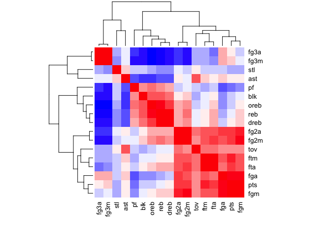
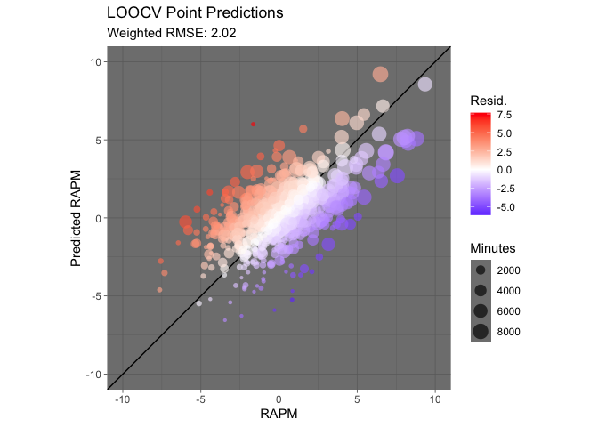

How to Make a Very Very Bad SPM
================
Andrew Patton

## What is an SPM?

Statistical Plus Minus (SPM) are models based on box score data
(usually) that attempt to predict a player’s RAPM, or [Regularized
Adjusted Plus
Minus](https://github.com/rd11490/NBA_Tutorials/tree/master/rapm). While
RAPM is a somewhat unbiased estimate of a player’s +/- value, an SPM can
help understand *why* a player might have that +/- value based on their
constituent box score components. SPMs you might have heard of include
but are not limited to [Daniel Myers](https://twitter.com/DSMok1)’
[BPM](https://www.basketball-reference.com/about/bpm.html) and [Jacob
Goldstein’s](https://twitter.com/JacobEGoldstein)
[PIPM](https://www.bball-index.com/current-pipm/) (Although PIPM
contains some non-SPM style lineup information). SPMs are traditionally
based in a standard linear regression framework, and do not necessarily
need the possession or stint level information needed for calculating
RAPM.

## What is an SPM not?

**SPMs are not explicit rankings of players.**

## Data

There are two datasets that you will need in order to follow along with
this tutorial, both are in the ‘data’ folder. The RAPM file just has
player identification and three year RAPM, and the box scores has player
identification and three year box score totals.

1)  RAPM (three\_year\_rapm.csv) via [Ryan Davis the public RAPM
    king](http://nbashotcharts.com/rapm3?id=-357354019)
2)  Box Scores (three\_year\_box\_scores.csv) via NBA.com (only with
    players \> 100 minutes)

## Step 1: Getting the data set up

``` r
## Read in and convert everything to per 48 minutes
box <- read_csv("data/three_year_box_scores.csv") %>% 
  mutate(across(!c(player_id, player_name, min), ~{48 * (.x/min)})) 

rapm <- read_csv("data/three_year_rapm.csv")

## Join the data together based on player id
spm_data <- box %>% 
  left_join(rapm, by = c("player_id"))

## Let's see what the column names are
print(names(spm_data))
```

    ##  [1] "player_id"   "player_name" "pts"         "fgm"         "fga"        
    ##  [6] "fg3m"        "fg3a"        "fg2m"        "fg2a"        "ftm"        
    ## [11] "fta"         "reb"         "oreb"        "dreb"        "ast"        
    ## [16] "stl"         "tov"         "blk"         "pf"          "min"        
    ## [21] "RAPM"

## Step 2: Setting up the model

At this point the data is ready for modeling. Something to keep in mind
is that we only have 634 observations - not exactly a huge dataset.
Let’s do an extremely naive attempt with all our data first, just for
proof of concept. Because we don’t have much data, let’s try a leave one
out cross validation to see what the range of coefficient values turn
out to be. Also, we’ll weight our regression by total minutes, since we
want to make sure we’re more correct on the players that play often.

``` r
players <- unique(spm_data$player_id)

box_score_components <- c("pts", "fgm", "fga", "fg3m", "fg3a", 
                          "fg2m", "fg2a", "ftm", "fta", "reb",
                          "oreb", "dreb", "ast",
                          "stl", "tov", "blk", "pf")

spm_formula <- formula(paste("RAPM ~ ", paste(box_score_components, collapse = " + ")))

coeff_list <- vector("list", length = length(players))

pred_list <- vector("list", length = length(players))

for(player in players) {
  
  training_data <- spm_data %>% 
    filter(player_id != player)
  
  testing_data <- spm_data %>% 
    filter(player_id == player)
  
  model <- lm(spm_formula, data = training_data)
  
  coeff_list[[which(players == player)]] <- model$coefficients 

}

coeff_frame <- bind_rows(coeff_list)

head(coeff_frame[, 1:10])
```

    ## # A tibble: 6 x 10
    ##   `(Intercept)`   pts    fgm    fga     fg3m  fg3a  fg2m  fg2a   ftm    fta
    ##           <dbl> <dbl>  <dbl>  <dbl>    <dbl> <dbl> <dbl> <dbl> <dbl>  <dbl>
    ## 1         -4.11 0.641 -0.443 -0.448 -0.0278  0.117    NA    NA    NA -0.231
    ## 2         -4.14 0.636 -0.438 -0.444 -0.00928 0.112    NA    NA    NA -0.228
    ## 3         -4.11 0.635 -0.440 -0.442 -0.00305 0.111    NA    NA    NA -0.225
    ## 4         -4.10 0.637 -0.437 -0.448 -0.0115  0.114    NA    NA    NA -0.228
    ## 5         -4.10 0.640 -0.442 -0.448 -0.0112  0.112    NA    NA    NA -0.231
    ## 6         -4.10 0.630 -0.423 -0.446 -0.0207  0.118    NA    NA    NA -0.223

Whoops. We have some NAs in the coefficients. If you ran the modeling
loop with warning=TRUE, you’d have seen that there are warnings thrown
that certain variables are ‘not defined due to singularities’ –
essentially certain variables are highly colinear. Here’s a quick way to
take a look at correlations between your variables, where blue is
negative and red is positive.

``` r
cor_mat <- cor(select(spm_data, all_of(box_score_components)))
colors <- colorRampPalette(c("blue", "white", "red"))(20)
heatmap(x = cor_mat, col = colors, symm = TRUE)
```

<!-- -->

Let’s try again but remove some of the NA’d variables or the summations
such as total rebounds. Colinearity in SPM models is an enormous issue
and something that should be handled with some thought, not just by
blindly hacking out variables. Now lets blindly hack out some variables.

``` r
players <- unique(spm_data$player_id)

box_score_components <- c("pts", "fgm", "fga", "fg3m", "fg3a", 
                          "fta", "oreb", "dreb", "ast",
                          "stl", "tov", "blk", "pf")

spm_formula <- formula(paste("RAPM ~ ", paste(box_score_components, collapse = " + ")))

coeff_list <- vector("list", length = length(players))

pred_list <- vector("list", length = length(players))

for(player in players) {
  
  training_data <- spm_data %>% 
    filter(player_id != player)
  
  testing_data <- spm_data %>% 
    filter(player_id == player)
  
  model <- lm(spm_formula, data = training_data, weights = min)
  
  coeff_list[[which(players == player)]] <- model$coefficients 
  pred_list[[which(players == player)]] <- predict(model, newdata = testing_data)
  
}

coeff_frame <- bind_rows(coeff_list)

head(coeff_frame[, 1:10])
```

    ## # A tibble: 6 x 10
    ##   `(Intercept)`   pts    fgm    fga   fg3m   fg3a    fta  oreb   dreb   ast
    ##           <dbl> <dbl>  <dbl>  <dbl>  <dbl>  <dbl>  <dbl> <dbl>  <dbl> <dbl>
    ## 1         -5.23 0.890 -0.632 -0.567 0.0762 0.0939 -0.368 0.491 0.0650 0.455
    ## 2         -5.31 0.880 -0.622 -0.558 0.105  0.0855 -0.360 0.475 0.0746 0.461
    ## 3         -5.25 0.883 -0.623 -0.564 0.0963 0.0901 -0.361 0.494 0.0643 0.458
    ## 4         -5.23 0.885 -0.625 -0.567 0.0988 0.0884 -0.363 0.489 0.0647 0.456
    ## 5         -5.25 0.884 -0.623 -0.566 0.0944 0.0903 -0.362 0.489 0.0654 0.457
    ## 6         -5.25 0.877 -0.606 -0.565 0.0818 0.0974 -0.356 0.490 0.0672 0.461

Alright, so it looks good in the sense that there are no NAs or
squirrely/impossible values. Now, let’s take a look at the distribution
of each coefficient just for another sanity check.

``` r
coeff_dist <- t(apply(coeff_frame, MARGIN=2, function(x) c(mean(x), sd(x)))) %>%
  as.data.frame() %>% 
  rownames_to_column(var = "variable") %>% 
  rename(mean_coeff = V1,
         sd_coeff = V2)

coeff_dist
```

    ##       variable  mean_coeff    sd_coeff
    ## 1  (Intercept) -5.25133478 0.035171360
    ## 2          pts  0.88347472 0.013849573
    ## 3          fgm -0.62256545 0.031023043
    ## 4          fga -0.56547538 0.005291640
    ## 5         fg3m  0.09305818 0.028874108
    ## 6         fg3a  0.09102667 0.010274823
    ## 7          fta -0.36164462 0.011410333
    ## 8         oreb  0.48949706 0.006902969
    ## 9         dreb  0.06537930 0.002874602
    ## 10         ast  0.45687714 0.003309119
    ## 11         stl  1.36234054 0.009344990
    ## 12         tov -0.91083441 0.010008775
    ## 13         blk  0.61655318 0.007599611
    ## 14          pf -0.19630137 0.004974011

Seems to be reasonable. Now, onto the predictions. Keep in mind that
this is a Very Very Bad SPM (VVBPM), and not something that you should
use. However, these results are generally in the right shape\!

``` r
spm_data <- spm_data %>% 
  mutate(pred_RAPM = unlist(pred_list)) %>% 
  mutate(resid = pred_RAPM - RAPM) 

error <- round(mltools::rmse(spm_data$RAPM, 
                             spm_data$pred_RAPM, 
                             weights = spm_data$min), 2)

A <- ggplot(data = spm_data, aes(x = RAPM, y = pred_RAPM)) +
  geom_abline() +
  geom_point(aes(color = resid, size = min), shape = 16, alpha = 0.65) +
  scale_color_gradient2(low = "blue",
                        mid = "white",
                        midpoint = 0,
                        high = "red",
                        name = "Resid.") +
  scale_size(name = "Minutes") +
  scale_x_continuous(limits = c(-10, 10), breaks = seq(-10, 10, 5)) +
  scale_y_continuous(limits = c(-10, 10), breaks = seq(-10, 10, 5)) +
  coord_fixed() +
  labs(x = "RAPM",
       y = "Predicted RAPM",
       title = "LOOCV Point Predictions",
       subtitle = paste0("Weighted RMSE: ", error)) +
  theme_dark()

print(A)
```

<!-- -->

Since a point prediction alone isn’t as useful as a distribution plus a
point prediction, here’s a way to get some semblance of a distribution.
Essentially sampling from the coefficient distributions to Monte Carlo
some predictions. Just kind of a quick and dirty method.

``` r
coeff_trials <- apply(coeff_dist, MARGIN=1, function(x) rnorm(100, as.numeric(x[2]), as.numeric(x[3])))

spm_function <- function(x) {
  
  res <- x[1] + x[2]*pts + x[3]*fgm + x[4]*fga 
  + x[5]*fg3m + x[6]*fg3a + x[7]*fta + x[8]*oreb
  + x[9]*dreb + x[10]*ast + x[11]*stl + x[12]*tov
  + x[13]*blk + x[14]*pf
  
  return(res)
  
}

player_spm_list <- vector("list", length = length(players))

for(player in players) {
  
  player_data <- spm_data %>%
    filter(player_id == player) %>% 
    select(all_of(box_score_components)) %>% 
    unlist()
  
  pts <- player_data['pts']
  fgm <- player_data['fgm']
  fga <- player_data['fga']
  fg3m <- player_data['fg3m']
  fg3a <- player_data['fg3a']
  fta <- player_data['fta']
  oreb <- player_data['oreb']
  dreb <- player_data['dreb']
  ast <- player_data['ast']
  stl <- player_data['stl']
  tov <- player_data['tov']
  blk <- player_data['blk']
  pf <- player_data['pf']
  
  player_spm_values <- apply(coeff_trials, MARGIN=1, function(x) spm_function(x))
  
  player_spm_frame <- data.frame(player_id = player,
                                  mean_spm = mean(player_spm_values),
                                  sd_spm = sd(player_spm_values))
  
  player_spm_list[[which(players == player)]] <- player_spm_frame
  
}

spm_data %>% 
  left_join(bind_rows(player_spm_list)) %>% 
  select(player_name, mean_spm, sd_spm, RAPM) %>% 
  arrange(-mean_spm, player_name) %>% 
  head(20)
```

    ## Joining, by = "player_id"

    ## # A tibble: 20 x 4
    ##    player_name           mean_spm sd_spm  RAPM
    ##    <chr>                    <dbl>  <dbl> <dbl>
    ##  1 James Harden              8.50  0.704  6.49
    ##  2 Stephen Curry             5.53  0.660  9.35
    ##  3 Joel Embiid               5.32  0.660  6.36
    ##  4 Isaiah Thomas             5.24  0.630  0.01
    ##  5 Kevin Durant              5.00  0.643  4.97
    ##  6 Kawhi Leonard             4.81  0.647  5.43
    ##  7 Giannis Antetokounmpo     4.61  0.628  8.8 
    ##  8 Anthony Davis             4.26  0.670  4.04
    ##  9 Damian Lillard            4.25  0.611  8.02
    ## 10 Lou Williams              3.98  0.589  0.67
    ## 11 Boban Marjanovic          3.96  0.557  4.79
    ## 12 DeMarcus Cousins          3.87  0.614  2.53
    ## 13 LeBron James              3.66  0.641  7.8 
    ## 14 Danilo Gallinari          3.55  0.467  4.94
    ## 15 Archie Goodwin            3.22  0.427 -0.31
    ## 16 Karl-Anthony Towns        3.02  0.580  5.58
    ## 17 Jimmy Butler              2.87  0.504  6.41
    ## 18 Kevin Love                2.77  0.509  4.02
    ## 19 Paul George               2.70  0.565  6.83
    ## 20 Christian Wood            2.64  0.494 -1.64

And now you have a Very Very Bad SPM with a smidge of distributions in
the predictions (mostly due to uncertainty in the data). Again, this
should be an extremely early starting point. You can add more or less
whatever you want to create a good SPM. Go check out the writeups for
[BPM 2.0](https://www.basketball-reference.com/about/bpm2.html) and
[PIPM](https://fansided.com/2018/01/11/nylon-calculus-introducing-player-impact-plus-minus/)
to see how those are made.
