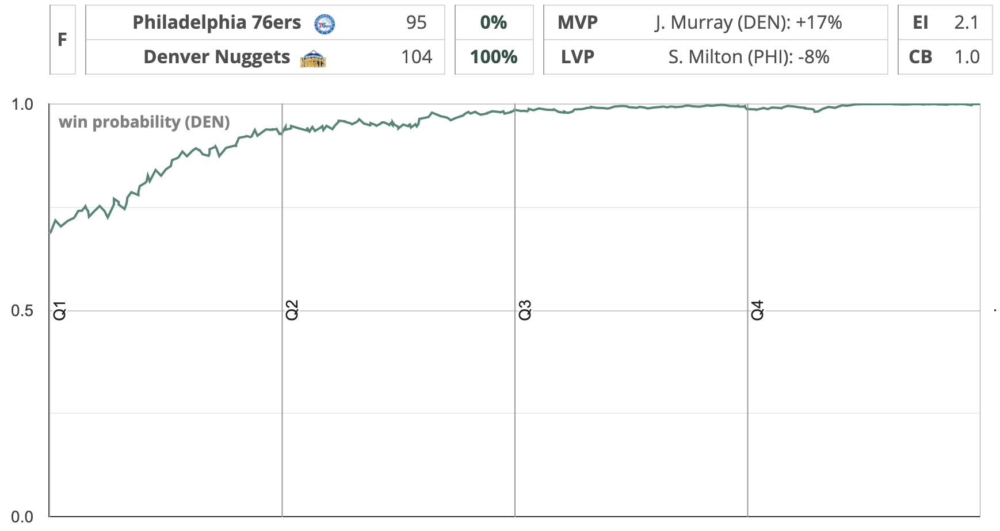
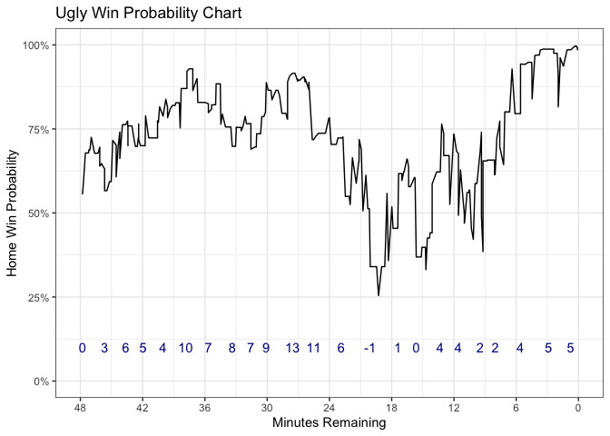

How to Make a Win Probability Model
================
Andrew Patton

## What is a Win Probability Model?

In our tutorial here a win probability model is a model that predicts
which team will win the game at each minute (or whatever other increment
you choose) throughout a game. You may have seen graphs that look like
this as the output of one of these models.



This exact example is taken from [Mike
Beuoy’s](https://twitter.com/inpredict) website
[www.inpredictable.com](https://www.inpredictable.com/). He is more or
less the main and best win probabily guy in the game. If you don’t
follow Mike or read his excellent website, you should. What we’re going
to do is a very simple version of what you see on that site, and will
produce a chart like the above as a final product. Let’s get into it.

## Data

We’re keeping it simple and just using play-by-play data to conduct our
modeling. More effective models use pregame point spreads, team ratings,
various and complex home court and travel adjustments, etc. We’re going
lukewarm tap water here and sticking to the basics.

1.  pbp.parquet - simply a somewhat pre-cleaned play by play file from
    the 2018-19 season, the last before COVID-19 impacts. We went with
    parquet because these pbp files are big, and parquet compresses them
    down a bit for easy read in and uploading. Sidenote, go get
    vaccinated if you can/are able so I can go see an NBA game in person
    next season.

## Step 1: Format the data how we want it and decide what’s going into the model

One of the most important parts of this (or any) model is deciding what
variables we think are important for predicting if a team wins a game
given the current game situation. Since we want a probability as out
outcome, we’ll be using a binary classifier which returns a probability
of win between 0-1. To build the model though, the two obvious ones are
scoring margin and time remaining on the clock. Also, let’s include the
actual score as a three point margin in a 130-133 game is a little less
meaningful than in a 75-78 game. This is also a proxy for pace if you
think about it. Next we should also make sure to separate based on home
and away. If it’s good enough for Vegas, we need it. Also, let’s try and
add cumulative fouls in as well. Maybe identifying the bonus or too many
players in foul trouble will help out model.

We’re just simply doing some cumulative sums across scoring to get out
variables, and making sure that fouls are assigned to the proper team.
Also flipping the game time because the guy who scraped this data (me)
is a dumb dumb.

When you’re starting out, resist the urge as [Senthil
Natarajan](https://twitter.com/SENTH1S) says to “\[dump\] 25 features
into a cauldron, \[chant\] ‘XGBoost’ three times and \[wave\] our magic
wand”. We will be dumping fewer features into our models (but still use
XGBoost).

``` r
library(tidyverse)
library(arrow)
library(knitr)
set.seed(42)

pbp <- arrow::read_parquet("data/pbp.parquet") %>% 
  filter(is.na(nameTeam) == FALSE) %>% 
  filter(is.na(eventGeneral) == FALSE) %>% 
  replace_na(list(shotResultPoints = 0)) %>% 
  mutate(home_points_scored = ifelse(nameTeam == homeTeam, shotResultPoints, 0)) %>% 
  
  mutate(away_points_scored = ifelse(nameTeam == awayTeam, shotResultPoints, 0)) %>% 
  mutate(home_foul = ifelse(nameTeam == homeTeam & grepl("foul", .$eventType), 1, 0)) %>%
  mutate(away_foul = ifelse(nameTeam == awayTeam & grepl("foul", .$eventType), 1, 0)) %>%
  mutate(time_remaining = 2880 - gametime) %>% 
  group_by(idGame) %>% 
  mutate(home_score = cumsum(home_points_scored)) %>% 
  mutate(away_score = cumsum(away_points_scored)) %>% 
  mutate(home_margin = home_score - away_score) %>% 
  mutate(home_foul_totals = cumsum(home_foul)) %>%
  mutate(away_foul_totals = cumsum(away_foul)) %>%
  mutate(home_win = ifelse(max(home_score) > max(away_score), 1, 0)) %>% 
  ungroup() %>% 
  select(idGame, time_remaining, home_score, away_score, home_margin, 
         home_foul_totals, away_foul_totals, home_win) 

kable(pbp[3:12, -1], align = "c")
```

| time\_remaining | home\_score | away\_score | home\_margin | home\_foul\_totals | away\_foul\_totals | home\_win |
|:---------------:|:-----------:|:-----------:|:------------:|:------------------:|:------------------:|:---------:|
|      2835       |      0      |      0      |      0       |         0          |         0          |     1     |
|      2833       |      0      |      0      |      0       |         0          |         0          |     1     |
|      2828       |      0      |      0      |      0       |         0          |         0          |     1     |
|      2823       |      0      |      0      |      0       |         0          |         0          |     1     |
|      2818       |      0      |      0      |      0       |         0          |         0          |     1     |
|      2815       |      0      |      2      |      -2      |         0          |         0          |     1     |
|      2796       |      0      |      2      |      -2      |         0          |         0          |     1     |
|      2795       |      0      |      2      |      -2      |         0          |         0          |     1     |
|      2792       |      0      |      2      |      -2      |         0          |         0          |     1     |
|      2789       |      0      |      2      |      -2      |         0          |         0          |     1     |

## Step 2: Let’s model the thing

So with our data setup the way we want, we need to do a quick review on
how we’re going to model this. The `home_win` column is our target
variable, or what we’re trying to predict. Everything else besides
`idGame` is going to go into the model. Nice and easy.

### Logistic Regression

The first thing we’re going to try is a [logistic
regression](https://stats.idre.ucla.edu/r/dae/logit-regression/) that
takes our input data and returns a probability of `home_win`. If you’re
new to R, master this section before moving onto the next. I promise you
it’s worth your time.

### Step 1: Split the data and build the model

Our very first step is to split our data into training and testing. This
should *not* be done randomly, but on the game level. We want all the
games in train to only be in train and all the games in test to only be
in test. Otherwise you get serious leakage issues. Note, we’re removing
`home_margin` from this model because otherwise it’ll throw a warning
and give us NA’s due to the presence of `home_score` and `away_score`
resulting in the same value.

``` r
games <- unique(pbp$idGame) ## get all the unique games (there are 500 of them)

train_games <- sample(games, 0.8 * length(games)) ## select 400 games for our training set

train <- pbp %>% 
  filter(idGame %in% train_games) 

test <- pbp %>% 
  filter(!idGame %in% train_games) 

mod <- glm(home_win ~ ., family = "binomial", data = select(train, -idGame, -home_margin))

summary(mod) ## eat it python
```

    ## 
    ## Call:
    ## glm(formula = home_win ~ ., family = "binomial", data = select(train, 
    ##     -idGame, -home_margin))
    ## 
    ## Deviance Residuals: 
    ##     Min       1Q   Median       3Q      Max  
    ## -3.0070  -0.8398   0.3221   0.8221   2.5228  
    ## 
    ## Coefficients:
    ##                    Estimate Std. Error  z value Pr(>|z|)    
    ## (Intercept)       7.441e-01  1.130e-01    6.585 4.54e-11 ***
    ## time_remaining   -1.264e-04  4.003e-05   -3.158  0.00159 ** 
    ## home_score        1.491e-01  9.610e-04  155.104  < 2e-16 ***
    ## away_score       -1.613e-01  1.012e-03 -159.366  < 2e-16 ***
    ## home_foul_totals -1.901e-02  2.354e-03   -8.076 6.67e-16 ***
    ## away_foul_totals  6.214e-02  2.524e-03   24.615  < 2e-16 ***
    ## ---
    ## Signif. codes:  0 '***' 0.001 '**' 0.01 '*' 0.05 '.' 0.1 ' ' 1
    ## 
    ## (Dispersion parameter for binomial family taken to be 1)
    ## 
    ##     Null deviance: 217261  on 160340  degrees of freedom
    ## Residual deviance: 157759  on 160335  degrees of freedom
    ## AIC: 157771
    ## 
    ## Number of Fisher Scoring iterations: 5

Those coefficients all look sensible and square with what we know about
basketball. Now, let’s see how our model does from a prediction
standpoint.

### Step 2: Evaluate the model

``` r
library(Metrics)

train_predictions <- predict(mod, train, type = "response")
train_predictions_01 <- round(train_predictions, 0)
train_accuracy <- Metrics::accuracy(train$home_win, train_predictions_01) 

test_predictions <- predict(mod, test, type = "response")
test_predictions_01 <- round(test_predictions, 0)
test_accuracy <- Metrics::accuracy(test$home_win, test_predictions_01) 

print(paste0("Training Accuracy %: ", round(100 * train_accuracy, 1)))
```

    ## [1] "Training Accuracy %: 75.3"

``` r
print(paste0("Testing Accuracy %: ", round(100 * test_accuracy, 1)))
```

    ## [1] "Testing Accuracy %: 74.9"

Not bad! We’ll leave that model alone for now and move along. However,
something important to note is that if we look at the first prediction
of any game, we can determine what the home court advantage is. If it’s
greater than 50% (which ours is at \~58 percent), that’s the home team,
and less than 50% it’s the away team. Keep in mind that’s only possible
because there is no team-specific information contained in this model.

``` r
print(paste0("The chance of a home team winning a game at tip is ", round(100 * train_predictions[1], 1), "%"))
```

    ## [1] "The chance of a home team winning a game at tip is 59.4%"

### XGBoost

Now let’s learn some machines extremely using
[XGBoost](https://xgboost.readthedocs.io/en/latest/index.html), one of
the gold standard gradient boosting tree libraries. We’re going to
broadly speaking repeat the same process as before. We split our data
into train and test, and then build our model and evaluate it. There’s
quite a bit more code here since the process for XGBoost is a bit more
complex. Keep in mind that this is not an endorsement that XGBoost is
automatically better than logistic regression. It’s far easier to make a
garbage model with machine learning if you’re not careful. The upside is
that we can probably get some more predictive power, although our
intentionally simplified feature space will likely put a damper on that.

### Step 1: Split the data and decide on cross validation

We split the data more or less the same as we did with out previous
model, just a few formatting steps to get the datasets into the proper
type for XGBoost. Since we’re going to be CV’ing our model, we need to
decide carefully how to do that. Just as when we made sure that all
games in train and test are distinct, we need to do that as well for our
CV folds. No game should be trained on and the tested on in the CV or
the overall evaluation. We use `splitTools::create_folds()`, helped out
via [the Computer Cowboy himself, Ben
Baldwin,](https://twitter.com/benbbaldwin) to create indices on the game
level. If this doesn’t quite make sense, take some time and line by line
it. The vast majority of the work for machine learning (non-deep
learning edition) is properly setting up validation and evaluation
methods, not coding the actual models.

``` r
library(splitTools)

games <- unique(pbp$idGame) 

train_games <- sample(games, 0.8 * length(games))

train <- pbp %>% 
  filter(idGame %in% train_games)

test <- pbp %>% 
  filter(!idGame %in% train_games)

x_train <- train %>% 
  select(-idGame, -home_win) %>% 
  as.matrix() ## xgboost necessary step, although you can use other ways

y_train <- as.numeric(train$home_win)

x_test <- test %>% 
  select(-idGame, -home_win) %>% 
  as.matrix() ## xgboost necessary step, although you can use other ways

y_test <- test$home_win

#grouped_folds <-  map(0:4, function(x) { ## this was 100% written by Ben Baldwin and is a manual splitter
#  fold_indices <- which(train$idGame %in% games[(1 + 80 * x) : (80 + (x * 80))])
#  return(fold_indices)
#  })

grouped_folds <- splitTools::create_folds(train$idGame, k = 5, type = "grouped", invert = TRUE)
```

### Step 2: Tuning

With the splits and groups defined, we move onto the tuning of the
hyperparameters of the model. Hyperparameters essentially control how
the model learns. XGBoost comes with solid default values, but let’s
give a quick tune anyway. Our first step is to define the grid of values
which we want to use. Lines 165-177 just create a list of lists each of
which contains a random sample of values based on our setup. [This grid
was more or less taken directly from this blog
post](https://towardsdatascience.com/getting-to-an-hyperparameter-tuned-xgboost-model-in-no-time-a9560f8eb54b).

``` r
param_grid = list()

for(i in 1:5){
  
  param_grid[[i]] <- list(booster = "gbtree",
                          objective = "binary:logistic",
                          max_depth = sample(c(3:10), 1),
                          eta = runif(1, .01, .3),
                          subsample = runif(1, .7, 1),
                          colsample_bytree = runif(1, .6, 1),
                          min_child_weight = sample(0:10, 1))
  
}
```

### Step 3: The actual model

Next, we’re going to set up our tuning to run in parallel. This is
actually the part I’m least confident that I did in the best or even
good manner. If you’re more experienced at this than I am in R, please
let me know and I’ll adjust. We’re going to use `parallel::parLapply()`
to apply XGBoost across our list of parameters, `param_grid`. This will
take a bit of time to run, so I suggest not doing it in the Rmd.

``` r
par_xgboost <- function(params, data, labels, folds) {
  
  xgbcv <- xgboost::xgb.cv(params = params, 
                           data = x_train, 
                           label = y_train,
                           nrounds = 1000, ## somewhat arbitrary, can let early stopping solve this
                           folds = folds,
                           early_stop_round = 5,
                           eval_metric = "error")
  
  test_error <- xgbcv$evaluation_log %>% 
    filter(test_error_mean == min(test_error_mean)) %>% 
    pull(test_error_mean)
  
  return(list(test_error, params, xgbcv$niter))
  
}

cores_minus_one <- parallel::detectCores() - 1 

cl <- parallel::makeCluster(spec = cores_minus_one) 

parallel::clusterExport(cl, c("par_xgboost", "x_train", "y_train", "grouped_folds"))

parallel::clusterEvalQ(cl, {
  library(dplyr)
  library(xgboost)
})
```

    ## [[1]]
    ## [1] "xgboost"   "dplyr"     "stats"     "graphics"  "grDevices" "utils"    
    ## [7] "datasets"  "methods"   "base"     
    ## 
    ## [[2]]
    ## [1] "xgboost"   "dplyr"     "stats"     "graphics"  "grDevices" "utils"    
    ## [7] "datasets"  "methods"   "base"     
    ## 
    ## [[3]]
    ## [1] "xgboost"   "dplyr"     "stats"     "graphics"  "grDevices" "utils"    
    ## [7] "datasets"  "methods"   "base"     
    ## 
    ## [[4]]
    ## [1] "xgboost"   "dplyr"     "stats"     "graphics"  "grDevices" "utils"    
    ## [7] "datasets"  "methods"   "base"     
    ## 
    ## [[5]]
    ## [1] "xgboost"   "dplyr"     "stats"     "graphics"  "grDevices" "utils"    
    ## [7] "datasets"  "methods"   "base"     
    ## 
    ## [[6]]
    ## [1] "xgboost"   "dplyr"     "stats"     "graphics"  "grDevices" "utils"    
    ## [7] "datasets"  "methods"   "base"     
    ## 
    ## [[7]]
    ## [1] "xgboost"   "dplyr"     "stats"     "graphics"  "grDevices" "utils"    
    ## [7] "datasets"  "methods"   "base"

``` r
res <- parallel::parLapply(cl = cl, param_grid, 
                           function(x) par_xgboost(params = x, data = x_train, labels = y_train, folds = grouped_folds))

parallel::stopCluster(cl) 
```

### Step 4: Refit and evaluate

With the tuned model, we need to identify the parameters that resulted
in the lowest average cross validation error, which we do in the first
couple lines here, and then re-fit XGBoost using those parameters, and
evaluate on the test set. **If you are doing this for real, you need to
use a validation set in this final fit to prevent overfitting. I picked
50 rounds which should prevent that, but definitely something you should
do.**

``` r
best_error_index <- which.min(unlist(sapply(res, function(x) unique(x[[1]]))))
best_error <- res[[best_error_index]][[1]] 
best_param_set <- res[[best_error_index]][[2]] 
best_num_iterations <- res[[best_error_index]][[3]]

xgb_tuned <- xgboost::xgboost(params = best_param_set,
                              data = x_train,
                              label = y_train,
                              nrounds = best_num_iterations,
                              print_every_n = 10,
                              eval_metric = "error",
                              early_stopping_rounds = 5)
```

    ## [1]  train-error:0.374938 
    ## Will train until train_error hasn't improved in 5 rounds.
    ## 
    ## [11] train-error:0.231103 
    ## [21] train-error:0.229756 
    ## [31] train-error:0.226395 
    ## [41] train-error:0.223271 
    ## [51] train-error:0.220570 
    ## [61] train-error:0.217808 
    ## [71] train-error:0.214577 
    ## [81] train-error:0.212245 
    ## [91] train-error:0.209071 
    ## [101]    train-error:0.207013 
    ## [111]    train-error:0.204880 
    ## [121]    train-error:0.203671 
    ## [131]    train-error:0.201507 
    ## [141]    train-error:0.200197 
    ## [151]    train-error:0.198694 
    ## Stopping. Best iteration:
    ## [155]    train-error:0.198258

``` r
preds <- predict(xgb_tuned, x_test)
preds_01 <- round(preds, 0)

test <- test %>% 
  mutate(home_win_prob = preds) %>% 
  mutate(home_win_pred = preds_01)

print(paste0("Training Error %: ", round(100 * best_error, 1)))
```

    ## [1] "Training Error %: 23.9"

``` r
print(paste0("Testing Error %: ", round(100 * Metrics::accuracy(y_test, !preds_01), 1)))
```

    ## [1] "Testing Error %: 29"

### Step 5: Make a janky chart

``` r
random_game <- test$idGame[[1]]

plot_data <- test %>% 
  filter(idGame == random_game) %>% 
  mutate(time_remaining = time_remaining/60) %>% 
  mutate(home_win_prob = ifelse(time_remaining == 0 & home_margin > 0, 1,
                                ifelse(time_remaining == 0 & home_margin < 0, 0, home_win_prob)))

score_labels <- plot_data[seq(1, nrow(plot_data), 20), ] %>% 
  select(time_remaining, home_margin)

ggplot(data = plot_data, aes(x = time_remaining, y = home_win_prob)) +
  geom_line() +
  scale_x_reverse(limits = c(48, 0), breaks = seq(0, 48, 6)) +
  scale_y_continuous(limits = c(0, 1), labels = scales::percent_format(accuracy = 1)) +
  geom_text(data = score_labels, aes(x = time_remaining, y = 0.1, label = home_margin), color = "darkblue") +
  labs(title = "Ugly Win Probability Chart",
       x = "Minutes Remaining",
       y = "Home Win Probability") +
  theme_bw()
```

<!-- -->

There you go. Statistical and ML approaches to making a win probability
model. Couple things to consider 1) our model doesn’t include *any*
sample weighting, and you should think about the best ways to implement
that 2) how do you handle the fact that our predictions don’t always get
to 100% or 0% at the end of the game? Also, this is not a best practices
article on model building. We didn’t look at calibration, errors by
quarter, score, etc. Lots of things to improve on. Good luck.
